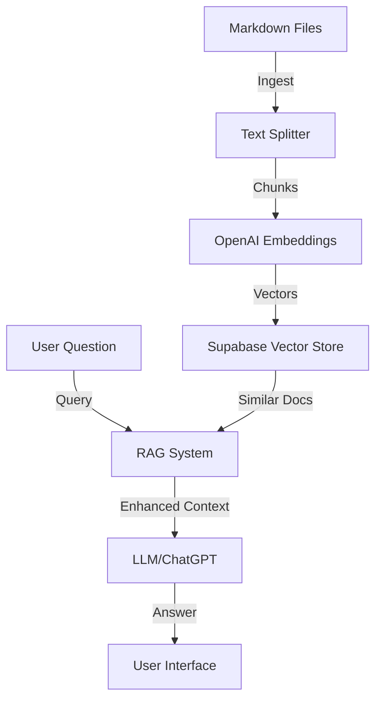

# RAG Implementation v1 Documentation

## System Overview

This is a Retrieval-Augmented Generation (RAG) system that uses Supabase's vector database for storing and retrieving document embeddings. The system consists of three main components:

1. Document Ingestion (`src/scripts/ingest.ts`)
2. Vector Storage (Supabase with pgvector)
3. RAG Query System (`src/lib/rag.ts`)

## Architecture



## Components in Detail

### 1. Document Ingestion (`src/scripts/ingest.ts`)

```typescript
// Key components of the ingestion process
const splitter = new RecursiveCharacterTextSplitter({
  chunkSize: 400,    // Each chunk is 400 characters
  chunkOverlap: 50   // 50 character overlap between chunks
});

const store = await SupabaseVectorStore.fromDocuments(
  docs,
  embeddings,
  {
    client: supabaseClient,
    tableName: 'documents',
    queryName: 'match_documents'
  }
);
```

The ingestion process:
1. Reads all `.md` files from `src/data/knowledge`
2. Splits them into chunks of 400 characters with 50 character overlap
3. Creates embeddings using OpenAI's embedding model
4. Stores documents and embeddings in Supabase

### 2. Vector Storage (Supabase)

The Supabase database has:

1. A `documents` table:
   - `id`: Unique identifier
   - `content`: The actual text chunk
   - `metadata`: Additional information about the chunk
   - `embedding`: Vector representation (1024 dimensions)

2. A `match_documents` function that:
   - Takes a query embedding vector
   - Returns similar documents based on cosine similarity
   - Supports filtering and threshold parameters

### 3. RAG Query System (`src/lib/rag.ts`)

```typescript
const retriever = store.asRetriever({ k: 4 });  // Get top 4 similar docs

export async function answer(question: string) {
  // 1. Get relevant documents
  const docs = await retriever.getRelevantDocuments(question);
  
  // 2. Combine documents into context
  const context = docs.map(d => d.pageContent).join("\n\n");
  
  // 3. Generate answer using LLM
  const response = await llm.invoke(
    await prompt.format({ context, question })
  );
}
```

The query process:
1. Takes a user question
2. Retrieves the 4 most relevant document chunks
3. Combines them into context
4. Uses ChatGPT to generate an answer based on the context

## Environment Setup

Required environment variables:
```env
NEXT_PUBLIC_SUPABASE_URL=your_supabase_url
NEXT_PUBLIC_SUPABASE_ANON_KEY=your_supabase_anon_key
OPENAI_API_KEY=your_openai_api_key
```

## Usage

1. Add knowledge by creating `.md` files in `src/data/knowledge/`
2. Run ingestion:
   ```bash
   bun run ingest
   ```
3. Access the chat interface at `/chat`
4. Ask questions related to your knowledge base

## Current Limitations

1. Only supports Markdown files
2. Fixed chunk size might not be optimal for all content
3. No metadata filtering implemented yet
4. In-memory retrieval only gets top K results without considering relevance threshold
5. No streaming responses
6. No conversation history/context

## Future Improvements (for v2)

1. Support more file types (PDF, DOC, etc.)
2. Dynamic chunk sizing based on content
3. Metadata-based filtering
4. Hybrid search (keyword + semantic)
5. Response streaming
6. Conversation context
7. Better prompt engineering
8. Source citations in responses 